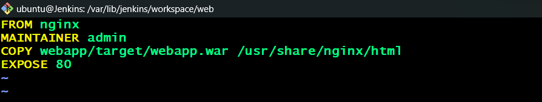
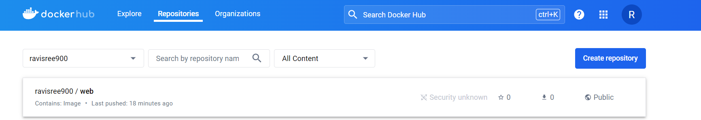
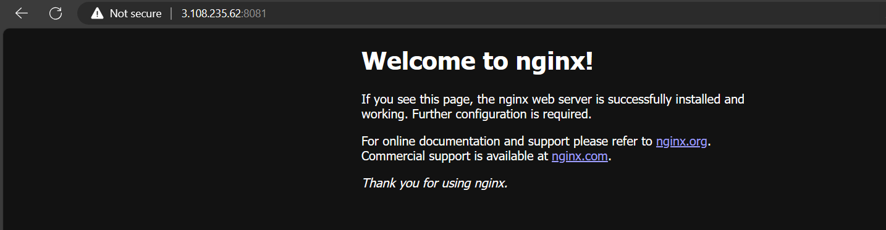

Creating an EC2 instance Manually on AWS with t2.medium with ports 8081 for Jenkins and 22 for SSH  Connection. {we can create the Jenkins server from Terraform Script also, But we need to create networking part and EC2 instance for Jenkins}.

Install Jenkins, Java and Docker on the EC2 instance.

Connect the EC2 instance with public ip on External Browser with port 8081 for accessing the Jenkins server.

Install Required plugins like Docker, Docker API, Docker Pipeline plugins.

Go to Manage Jenkins --> Tools Section --> Configure to install Maven and Docker.

Go to Manage Jenkins --> credentials --> click on Global --> Add docker credentials here.

Create a Project with name as you go with pipeline.

Create a Declarative pipeline for automated the CICD flow all the stages mentioned on Jenkinsfile.

Create a Dockerfile and Build the Docker image, Tag the Image and Push the Docker image into the DockerHub.

Create the Docker Container form the Docker image and Expose it to 8081 port.

Add the 8081 port to the Security group for  accessing the application from External Browser along with the Public Ip:8081.

Here we get an nginx default page, because we are using the base image as Nginx in dockerfile.

